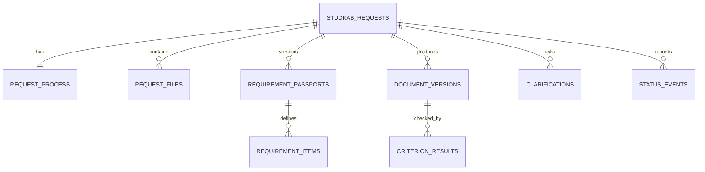
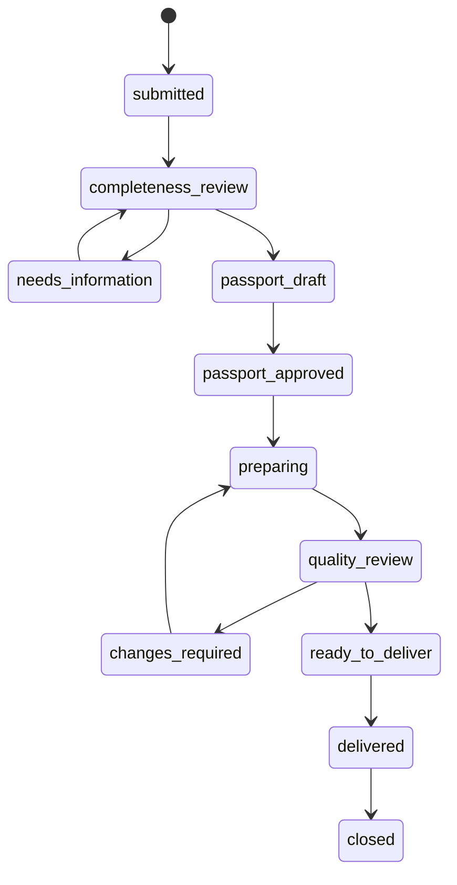

# Спецификация данных и единого процесса заявки

Версия: 1.0 (проект для согласования)

Основа: `QUALITY_STANDARD.md`, `FINANCIAL_COURSE_PROFILE.md`

Статус: проектирование; изменений действующей базы и приложения не выполняет

## 1. Цель

Спецификация определяет единый серверный процесс для «Кабинета студента» и «Реестра заявок»: заявку, файлы, паспорт требований, подготовку документа, контроль качества, версии результата, передачу и историю действий.

Главный результат — оба приложения показывают одно и то же подтверждённое сервером состояние. Локальные данные могут использоваться для интерфейса и офлайн-режима, но не являются источником истины для заявки и результата.

## 2. Текущее состояние и переход

Существующие данные сохраняются:

- `app_data` продолжает хранить пользовательские данные кабинета и реестра;
- `studkab_requests` остаётся исходной серверной заявкой;
- `studkab_results` остаётся историей переданных текстовых снимков;
- существующие идентификаторы заявок и результатов не меняются.

Подтверждённые проблемы текущей модели:

- у `studkab_requests` нет единого бизнес-статуса;
- кабинет и реестр хранят независимые статусы;
- файлы студента не передаются через заявку;
- повторная заявка не обновляет изменённые условия;
- переданный JSON может в будущем собраться другим экспортёром в визуально иной DOCX;
- паспорт, критерии, доказательства и история переходов отсутствуют.

Новая модель добавляется рядом с существующей. На первом этапе существующие таблицы не удаляются и не переименовываются.

## 3. Источник истины

| Данные | Источник истины |
|---|---|
| Рабочий статус заявки | Серверный процесс заявки |
| Автор и получатель | Неизменяемая исходная заявка и Supabase Auth |
| Исходные файлы | Закрытое Storage и серверные метаданные |
| Требования | Утверждённая версия паспорта |
| Результат проверки | Результаты для конкретной версии документа |
| Переданный документ | Неизменяемая версия DOCX и её контрольная сумма |
| История | Добавляемые события журнала |
| Черновые заметки интерфейса | `app_data`, пока они не утверждены сервером |

## 4. Роли и полномочия

### 4.1. Студент

Может:

- создавать свои заявки;
- читать только свои заявки и упрощённые статусы;
- загружать, заменять и отзывать свои файлы до установленной блокировки;
- отвечать на запросы уточнения;
- читать переданные ему версии и отчёты;
- инициировать скачивание своих результатов;
- запросить отмену или удаление в разрешённом состоянии.

Не может:

- читать чужие заявки, имена файлов, паспорта или результаты;
- утверждать паспорт и критерии качества;
- назначать себе роль исполнителя;
- изменять серверный статус напрямую;
- заменять файл после утверждения паспорта без создания новой версии и повторной проверки.

### 4.2. Исполнитель

Может:

- читать заявки и файлы в назначенной ему области;
- запрашивать уточнение;
- создавать и утверждать паспорт;
- запускать подготовку;
- фиксировать ручные решения по критериям;
- утверждать версию документа;
- передавать результат;
- закрывать и отменять заявку с причиной.

Роль исполнителя не определяется совпадением адреса из браузерных данных. Для пилота она хранится в недоступной пользователю серверной конфигурации или `app_metadata`. Пользователь не может самостоятельно изменить `app_metadata`.

### 4.3. Сервис

Edge Functions выполняют операции, требующие согласованной транзакции, проверки роли, доступа к Storage или служебного ключа. `service_role` не передаётся в браузер.

## 5. Логическая модель

Названия ниже проектные. Фактические имена определяются миграцией после проверки живой схемы.

## 6. Сущности

### 6.1. `request_process`

Одна запись на `studkab_requests`.

| Поле | Назначение |
|---|---|
| `request_id` | UUID существующей заявки, первичный и внешний ключ |
| `status` | Единый внутренний статус |
| `revision` | Версия состояния для защиты от одновременных изменений |
| `assigned_executor_id` | Назначенный исполнитель, если исполнителей станет несколько |
| `active_passport_id` | Утверждённая версия паспорта |
| `active_document_id` | Текущая рабочая версия документа |
| `delivered_document_id` | Последняя переданная версия |
| `due_at` | Срок с часовым поясом, если известен |
| `retention_until` | Текущий срок хранения |
| `created_at`, `updated_at` | Серверные временные отметки |

Владелец не дублируется из изменяемого браузерного payload: он определяется через `studkab_requests.student_id`.

### 6.2. `request_files`

Метаданные файла; бинарное содержимое хранится в private bucket.

| Поле | Назначение |
|---|---|
| `id` | Серверный UUID файла |
| `request_id` | Заявка-владелец |
| `student_id` | Неизменяемый владелец, сверяемый с заявкой |
| `purpose` | `assignment`, `guidelines`, `financials`, `bibliography`, `sample`, `other` |
| `version` | Версия файла данного назначения |
| `replaces_file_id` | Предыдущая версия |
| `storage_path` | Непубличный путь без исходного имени |
| `original_name` | Отображаемое исходное имя |
| `declared_mime`, `detected_mime` | Заявленный и проверенный тип |
| `size_bytes` | Размер |
| `sha256` | Контрольная сумма содержимого |
| `page_count` | Число страниц после разбора, если применимо |
| `state` | `uploading`, `quarantined`, `accepted`, `rejected`, `superseded`, `deleted` |
| `rejection_code` | Безопасная причина отказа |
| `created_at`, `accepted_at`, `deleted_at` | Серверные отметки |

Путь строится по серверным UUID, например `request-id/file-id/version`, а не по ФИО, теме или исходному имени.

### 6.3. `requirement_passports`

Неизменяемая версия паспорта после утверждения.

| Поле | Назначение |
|---|---|
| `id` | UUID версии паспорта |
| `request_id` | Заявка |
| `version` | Последовательный номер |
| `profile_code`, `profile_version` | Применённый профиль |
| `state` | `draft`, `needs_clarification`, `approved`, `superseded` |
| `source_set_hash` | Отпечаток набора входных файлов и уточнений |
| `created_by`, `approved_by` | Аккаунты действий |
| `created_at`, `approved_at` | Время |
| `supersedes_id` | Предыдущая версия |

Изменение утверждённого паспорта создаёт новую версию. Старую запись не редактируют.

### 6.4. `requirement_items`

| Поле | Назначение |
|---|---|
| `id` | UUID требования |
| `passport_id` | Версия паспорта |
| `code` | Код типового или индивидуального критерия |
| `rule_text` | Одно проверяемое условие |
| `source_type` | Задание, методичка, уточнение, стандарт или профиль |
| `source_file_id` | Файл-основание, если есть |
| `source_location` | Страница, лист, ячейка или раздел |
| `source_excerpt` | Минимальный необходимый фрагмент |
| `severity` | `critical`, `substantial`, `advisory` |
| `scope` | Работа, раздел, таблица, источник, DOCX или передача |
| `verification_method` | `automatic`, `manual`, `combined` |
| `applicability` | `applicable`, `not_applicable`, `unresolved` |
| `resolution_note` | Обоснование конфликта или неприменимости |

Автоматически извлечённый пункт хранится как проект до решения исполнителя.

### 6.5. `document_versions`

| Поле | Назначение |
|---|---|
| `id` | UUID версии документа |
| `request_id` | Заявка |
| `passport_id` | Паспорт, по которому создан документ |
| `version` | Последовательный номер |
| `state` | `building`, `ready_for_review`, `changes_required`, `approved`, `delivered`, `superseded` |
| `content` | Структурированный снимок текста и оформления |
| `content_sha256` | Отпечаток снимка |
| `docx_file_id` | Неизменяемый бинарный DOCX в Storage |
| `docx_sha256` | Отпечаток фактически проверенного файла |
| `exporter_version` | Версия сборщика DOCX |
| `created_by`, `created_at` | Автор и время |
| `approved_by`, `approved_at` | Ручное утверждение |

Передаётся сохранённый бинарный DOCX, а не повторно собранный в браузере файл. Это гарантирует совпадение проверенной и полученной версии.

### 6.6. `criterion_results`

Решение относится к конкретному требованию и версии документа.

| Поле | Назначение |
|---|---|
| `id` | UUID результата |
| `document_id` | Версия документа |
| `requirement_id` | Проверяемое требование |
| `status` | `pass`, `fail`, `not_applicable`, `unable_to_verify` |
| `evaluator_type` | `automatic`, `ai_assisted`, `human` |
| `evidence` | Структурированная ссылка на раздел, таблицу, расчёт или источник |
| `comment` | Причина решения или исправление |
| `decided_by`, `decided_at` | Исполнитель и время для ручного решения |
| `checker_version` | Версия автоматической проверки |

Результат ИИ не сохраняется как `human`. Повторная проверка создаёт новое решение или новую редакцию с историей, а не скрыто меняет прошлое.

### 6.7. `clarifications`

| Поле | Назначение |
|---|---|
| `id` | UUID вопроса |
| `request_id` | Заявка |
| `requirement_id` | Связанное требование, если есть |
| `question` | Вопрос исполнителя |
| `state` | `open`, `answered`, `accepted`, `closed` |
| `asked_by`, `asked_at` | Автор и время |
| `answer` | Ответ студента |
| `answered_by`, `answered_at` | Автор ответа и время |

Ответ не переписывает задание молча: после принятия он входит в новую версию паспорта.

### 6.8. `status_events`

Добавляемый журнал переходов.

| Поле | Назначение |
|---|---|
| `id` | Последовательный или UUID идентификатор |
| `request_id` | Заявка |
| `from_status`, `to_status` | Переход |
| `actor_id`, `actor_type` | Кто выполнил действие |
| `reason_code` | Безопасный машинный код |
| `entity_type`, `entity_id` | Связанная версия или файл |
| `created_at` | Серверное время |

События не содержат паролей, токенов, временных URL, полных промптов или содержимого исходных файлов.

## 7. Статусы и переходы

### 7.1. Внутренняя машина состояний

`cancelled` доступен из рабочих состояний по разрешённому действию с причиной. `deleted` не является обычным статусом работы: это завершение процедуры удаления после срока хранения или подтверждённого запроса.

### 7.2. Переходы и полномочия

| Из | В | Кто | Обязательное условие |
|---|---|---|---|
| — | `submitted` | Студент/сервис | Заявка и владелец подтверждены сервером |
| `submitted` | `completeness_review` | Исполнитель | Заявка открыта в реестре |
| `completeness_review` | `needs_information` | Исполнитель | Создан конкретный запрос уточнения |
| `needs_information` | `completeness_review` | Студент/исполнитель | Ответ или новый файл получен |
| `completeness_review` | `passport_draft` | Сервис | Комплектность позволяет разбор |
| `passport_draft` | `passport_approved` | Исполнитель | Нет критических конфликтов, паспорт утверждён |
| `passport_approved` | `preparing` | Исполнитель | Зафиксированы паспорт и набор материалов |
| `preparing` | `quality_review` | Сервис/исполнитель | Версия документа завершена и неизменяема для проверки |
| `quality_review` | `changes_required` | Исполнитель | Есть дефект с указанием критерия |
| `changes_required` | `preparing` | Исполнитель | Создаётся новая версия документа |
| `quality_review` | `ready_to_deliver` | Исполнитель | Все условия допуска выполнены |
| `ready_to_deliver` | `delivered` | Сервис | DOCX и отчёт сохранены атомарно, получатель проверен |
| `delivered` | `closed` | Исполнитель | Работа завершена; результат остаётся доступен до срока хранения |

Переход выполняется серверной командой с ожидаемыми `status` и `revision`. Устаревшая вкладка получает конфликт и обязана перечитать состояние.

### 7.3. Статусы студента

| Внутренний статус | Кабинет студента |
|---|---|
| `submitted`, `completeness_review` | Заявка получена |
| `needs_information` | Нужны дополнительные данные |
| `passport_draft`, `passport_approved`, `preparing` | Документ подготавливается |
| `quality_review`, `changes_required`, `ready_to_deliver` | Документ проверяется |
| `delivered` | Результат готов |
| `closed` | Работа завершена |
| `cancelled` | Заявка отменена |

Кабинет не показывает внутренние оценки или персональные заметки исполнителя.

## 8. Команды сервера

Клиент не обновляет таблицы процесса произвольно. Edge Function принимает ограниченные команды:

- `submit_request`;
- `begin_file_upload`, `finalize_file_upload`, `replace_file`, `remove_file`;
- `request_clarification`, `answer_clarification`, `accept_clarification`;
- `create_passport_draft`, `approve_passport`;
- `start_preparation`, `save_document_version`;
- `record_check`, `request_changes`, `approve_document`;
- `deliver_document`;
- `close_request`, `cancel_request`, `request_deletion`;
- `get_student_view`, `get_executor_view`.

Каждая команда проверяет пользователя, роль, владельца, текущее состояние, ожидаемую ревизию, лимиты и допустимый переход.

## 9. Файлы и Storage

### 9.1. Bucket

Используется отдельный private bucket, например `studkab-request-files`. Публичный доступ и постоянные публичные URL запрещены.

В bucket задаются допустимые MIME-типы и максимальный размер. Сервер повторно проверяет размер, расширение, MIME и сигнатуру, потому что браузерные значения нельзя считать доверенными.

### 9.2. Загрузка

1. Студент запрашивает разрешение на загрузку.
2. Сервер проверяет владельца, статус заявки, количество и общий объём.
3. Создаётся серверный UUID и запись `uploading`.
4. Файл загружается в непубличный путь.
5. Сервер вычисляет контрольную сумму и проверяет фактический тип.
6. Файл переходит в `quarantined`.
7. После безопасного разбора или проверки — в `accepted`; при проблеме — в `rejected`.
8. Только `accepted` участвует в паспорте и подготовке.

До подключения проверки вредоносного содержимого исполнитель не получает прямую кнопку запуска или открытия потенциально активного файла. Для просмотра используются безопасное преобразование или скачивание после явного предупреждения.

### 9.3. Чтение

Студент читает только собственные файлы. Исполнитель получает краткоживущую серверную ссылку после проверки роли и связи с заявкой. Ссылка не сохраняется в журнале и не отправляется студенту.

Поскольку подписанная ссылка действует до истечения срока, даже если пользователь вышел, срок должен быть минимальным. Для чувствительных документов предпочтительно скачивание с JWT и RLS без переносимой ссылки.

### 9.4. Замена и удаление

Замена создаёт новый объект и новую запись, а прежний файл становится `superseded`. Upsert одного пути не используется. Это сохраняет доказательства и исключает незаметную подмену файла.

После утверждения паспорта замена исходного файла:

- создаёт новую версию;
- переводит процесс в `completeness_review`;
- помечает активный паспорт и непереданный документ устаревшими;
- требует повторного утверждения.

## 10. Авторизация и RLS

### 10.1. Общие правила

- RLS включается на всех новых таблицах в exposed schema.
- Права `anon` отзываются, если они не требуются явно.
- `authenticated` получает только необходимые операции.
- Каждая политика студента проверяет `auth.uid()` против `studkab_requests.student_id`.
- Одного `TO authenticated` недостаточно.
- Для `UPDATE` задаются `USING` и `WITH CHECK`.
- Роль исполнителя хранится только в доверенных серверных данных; `user_metadata` не используется.
- Служебные функции и ключи доступны только серверу.

### 10.2. Предпочтительная модель доступа

Студентские чтение и загрузка могут выполняться через RLS. Изменения процесса, утверждения и передача выполняются только Edge Function. Прямые `INSERT/UPDATE/DELETE` в таблицы паспортов, результатов проверки, документов и событий для браузерных ролей запрещены.

Если таблицы не выставлены в Data API по настройкам проекта, права выдаются явно только необходимым объектам. Выставление таблицы и RLS рассматриваются как два отдельных контроля.

### 10.3. Исполнитель

Для пилота предпочтителен закрытый список исполнителей с `user_id`, состоянием доступа и датой отзыва. Проверка только по email сохраняется лишь как временная совместимость. Отзыв доступа должен прекращать новые привилегированные операции после обновления или проверки сессии.

## 11. Версии и неизменяемость

- Утверждённый паспорт не редактируется; создаётся следующая версия.
- Версия документа связана с одной версией паспорта и набором файлов.
- Автоматические и ручные результаты связаны с одной версией документа.
- После изменения текста создаётся новая версия или новый контрольный отпечаток; прошлое утверждение не переносится автоматически.
- Проверенный DOCX сохраняется как бинарный объект с SHA-256.
- Передача ссылается на этот объект и контрольную сумму.
- Новая передача создаёт новую запись и не удаляет предыдущую.

## 12. Транзакционные операции

### 12.1. Утверждение паспорта

Одна серверная транзакция:

1. блокирует строку процесса;
2. сверяет ожидаемые статус и ревизию;
3. проверяет критические требования и набор файлов;
4. переводит паспорт в `approved`;
5. устанавливает `active_passport_id`;
6. обновляет статус и ревизию;
7. добавляет событие.

### 12.2. Утверждение документа

Одна транзакция проверяет:

- документ связан с активным паспортом;
- контрольная сумма совпадает;
- все применимые критические критерии имеют `pass`;
- существенные дефекты устранены или разрешены по правилам профиля;
- DOCX создан, открыт для проверки и подтверждён исполнителем;
- документ не изменился после решений.

### 12.3. Передача

Одна идемпотентная операция по `delivery_id`:

1. проверяет роль исполнителя;
2. блокирует процесс заявки;
3. сверяет владельца, статус, ревизию и утверждённую версию;
4. сохраняет связь с неизменяемым DOCX и отчётом;
5. переводит статус в `delivered`;
6. добавляет событие;
7. возвращает подтверждённые идентификатор, версию и время.

Повтор с тем же `delivery_id` и тем же содержимым безопасно возвращает прежний результат. Иное содержимое с тем же идентификатором отклоняется как конфликт.

## 13. Повторная заявка и изменения условий

Текущее противоречие «можно отправить снова — данные обновятся» устраняется следующим правилом:

- до `passport_approved` студент может обновлять сведения и файлы с созданием новой ревизии;
- после `passport_approved` студент создаёт запрос изменения;
- исполнитель либо возвращает процесс к проверке комплектности, либо отклоняет запрос с причиной;
- отправка старого payload не создаёт дубль;
- изменённый payload не заменяет принятую заявку молча.

Интерфейс сообщает фактический результат: «Изменения отправлены на согласование», а не «данные обновлены», пока сервер не подтвердил переход.

## 14. Уведомления и получение результата

Уведомление создаётся только после подтверждённого перехода в `delivered`. Ошибка уведомления не отменяет сохранённый результат; она фиксируется отдельно и повторяется безопасно.

Сервер может зафиксировать выдачу файла или начало скачивания, но не должен утверждать, что студент прочитал документ. Пользовательский статус «Получен студентом» не применяется без отдельного подтверждения студента.

## 15. Сроки хранения

Срок рассчитывается от серверного события завершения. Процедура удаления:

1. выбирает записи с истёкшим сроком;
2. помечает пакет на удаление;
3. удаляет объекты Storage по точным путям;
4. проверяет отсутствие объектов;
5. минимизирует или удаляет связанные персональные данные;
6. сохраняет безопасное событие выполнения без содержимого документа;
7. учитывает срок резервной копии.

Удаление не выполняется по широкому префиксу без предварительного точного списка объектов.

## 16. Согласованность с существующими результатами

На переходном этапе:

- новые результаты получают `document_version_id` и бинарный DOCX;
- старые `studkab_results.document` остаются доступными через прежний путь;
- старый результат помечается как `legacy_generated_on_download`;
- интерфейс честно сообщает, что исторический файл формируется текущим экспортёром и не имеет сохранённой контрольной суммы первоначального DOCX;
- миграция не объявляет старый результат проверенным по новому стандарту.

## 17. План безопасного внедрения

### Фаза A. Инвентаризация

- снять только метаданные живой схемы, политик, функций и bucket;
- подтвердить версии развёрнутых Edge Functions;
- зафиксировать количество и связи существующих заявок и результатов;
- проверить резервную копию и процедуру восстановления;
- не читать содержимое пользовательских документов без необходимости.

### Фаза B. Аддитивная миграция

- создать новые таблицы, ограничения, индексы и RLS;
- не удалять и не менять существующие столбцы;
- создать private bucket и лимиты;
- добавить серверные функции в выключенном режиме;
- выполнить тесты безопасности и Database Advisor.

### Фаза C. Обратная совместимость

- создать `request_process` для существующих серверных заявок;
- присвоить безопасный начальный статус без утверждения качества;
- сохранить старый путь чтения результата;
- проверить, что кабинет и реестр продолжают открывать существующие данные.

### Фаза D. Поэтапное включение

- включить новый путь только для тестового аккаунта;
- провести заявку от загрузки до результата;
- проверить чужой аккаунт, конфликт вкладок, повтор, сбой сети и восстановление;
- после приёмки включать для новых заявок;
- существующие активные заявки не переводить автоматически без решения исполнителя.

### Фаза E. Удаление старой логики

Выполняется отдельным PR только после периода стабильной работы, резервной копии и подтверждения отсутствия обращений к старому пути.

## 18. Откат

До миграции фиксируется точка восстановления. Первая версия схемы аддитивна, поэтому откат приложения выполняется отключением новой функции и возвратом старого клиента.

Откат не удаляет новые таблицы и файлы. Они переводятся в режим только чтения до анализа. Обратная миграция с удалением данных запрещена в аварийном сценарии.

## 19. Проверки реализации

### 19.1. Модульные

- допустимые и запрещённые переходы;
- расчёт студенческого статуса;
- ревизии и конфликты;
- лимиты файлов;
- инвалидирование паспорта и проверки;
- идемпотентность передачи.

### 19.2. SQL и RLS

- студент читает только свои строки и файлы;
- другой студент не получает даже метаданные;
- студент не утверждает паспорт или документ;
- отозванный исполнитель теряет доступ;
- прямой вызов служебной функции запрещён;
- `UPDATE` не меняет владельца;
- журнал нельзя переписать клиентом.

### 19.3. Browser

- загрузка, повтор и восстановление после сети;
- замена файла и новая версия;
- запрос уточнения между приложениями;
- конфликт двух вкладок;
- блокировка при критическом дефекте;
- совпадение проверенного и скачанного DOCX;
- понятные статусы на мобильном экране.

### 19.4. Сквозная приёмка

- тестовый студент отправляет полный комплект;
- исполнитель утверждает паспорт;
- документ проходит исправление и контроль;
- сервер атомарно передаёт точную версию;
- повторный вход сохраняет всю цепочку;
- чужой аккаунт не получает доступ;
- откат клиента не повреждает созданные данные.

## 20. Решения для макетов

Макеты должны использовать эту спецификацию и показывать:

### Кабинет студента

- пошаговую заявку и комплектность;
- безопасную загрузку и состояния файлов;
- запросы уточнения;
- упрощённый серверный статус;
- результат, версию, ограничения и скачивание.

### Реестр исполнителя

- обзор и критические проблемы;
- документы заявки;
- паспорт с источниками и конфликтами;
- подготовку по утверждённой версии;
- контроль критериев и доказательств;
- утверждение и передачу конкретного DOCX;
- историю статусов и версий.

Макеты не должны показывать несуществующую автоматическую проверку источников, заимствований или научной достоверности.
