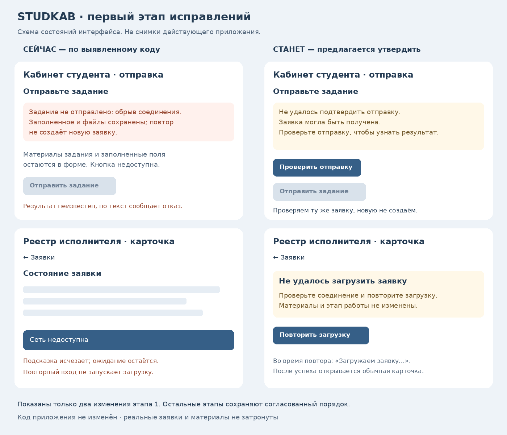

### Установка PR238 — подтверждённый итог
PR238 объединён: c77314a3bf2ce675dee20400e6e0ca6aee95823d; проверенный head db26969e82e044c80e119e3454ad7a98fd27564e. Safety 37786395331 завершён успешно: browser 236/236, Node 751/751, pretest 15/15, SQL/конкурентность/A1/replay успешны. Pages 37788159077: build и deploy успешны; app-navigation.js, index.html, reestr.html и sw.js с опубликованного сайта побайтно совпадают с локальным кодом. Настоящий аккаунт: после обновления интерфейса «Работы → Календарь → browser Back» возвращает прежний список из четырёх работ; данные не редактировались. Снимок studkab-238-navigation-1791467917020.jpg сохранён. Приёмка карточки №6 в аккаунте исполнителя ещё не выполнена; отсутствие подтверждённого запуска Claude проверено браузерным набором, а не фактическим выполнением работы.

Для публикации журналов выполнена дополнительная проверка: historical TRACEABILITY.md/CHANGE_CONTROL.md совпадают с публичными blobs 75322530c584350a48492c1769ec6683acbe2a45 / ae47fa1fd65b5e94a11cf7b0f19c6eb63b699c8c. Различия — только новые записи текущего пакета и ранее выполненной приёмки CAL-IMPORT. После представления этого доказательства автоматический контроль повторно отклонил полный TRACEABILITY.md, потребовав прямое пользовательское разрешение на этот чувствительный полный документ/назначение. Дальнейшие попытки прекращены. Полные три журнала по-прежнему доступны локально; исторические части не удалялись. Выбор трёх помощников: макет готов, код не написан до согласования картинки. Весь пользовательский список не закрыт.

### Публикация повторной сверки — PR238
Код и проверки опубликованы отдельным draft PR238, head db26969e82e044c80e119e3454ad7a98fd27564e: восемь файлов, без журналов или макета. Safety 37786395331 запущен. До результата полного CI объединение не выполняется. Автоматический контроль отклонил создание полного TRACEABILITY.md из-за исторических чувствительных операционных сведений; затем отклонил пакет дерева с TASK.md/прочими журналами. Полные локальные версии TASK.md, TRACEABILITY.md, CHANGE_CONTROL.md не опубликованы этим пакетом. Риск не обходится: единственный принятый пакет дерева содержит только код и тесты; прежние журналы на GitHub не изменены. Для публикации точных полных версий нужно отдельное явное разрешение на их историческое содержимое и назначение innaodincova-finpro/studkab. Макет выбора помощника ещё требует утверждения до написания интерфейса.

## UX-RECOVERY-01 — повторная сверка полного списка, 08.10.2026

После поручения владельца «Выполняй» весь присланный список сопоставлен с действующим кодом. UX-R01/R02/R03/R04/R05 уже реализованы в опубликованных страницах; рабочая приёмка всей цепочки не закрыта. Найдены остатки UX-R06 (browser Back/Forward) и UX-R07 (подпись «В работе» рядом с ожиданием запуска). Они исправлены локально: app-navigation.js — общая история двух ролей, позиции, фильтры и защита при смене аккаунта; reestr.html — единая подпись ожидания и конкретное действие в чате. Серверные этапы, заявки и материалы не изменяются. sw.js v132 включает новую навигацию в автономный комплект.

Предыдущий пакет UX-RECOVERY явно исключал выбор провайдеров; это не выполнение присланного полного списка. По нынешнему поручению подготовлен макет общего выбора Claude / ChatGPT/Codex / DeepSeek: docs/ui/UX_ASSISTANT_CHOICE_2026-10-08.png. До написания этого интерфейса требуется утверждение картинки по ROUTE-03. Смена способа не должна удалять прежние материалы, историю или результаты; чат не запускается сам от выбора, API — только после серверной проверки и подтверждения стоимости. Реальная причина остановки Claude по заявке не установлена. Платных обращений не было.

Проверки: 47/47 адресных Node (вложения маршрута, Claude, автономный комплект, сохранность, общая история); добавлены 5 браузерных сценариев Back/Forward двух ролей/смены аккаунта и проверка подписи ожидания. Локальный Playwright не запускает Chromium: сначала нет требуемой версии, установленная прежняя версия завершается на socket() Operation not permitted; ни один такой сценарий не считается пройденным. Обязательный полный CI выполняется в GitHub перед объединением. Установка этого исправления и приёмка реальной заявки остаются открыты.

Откат: вернуть только страницы, app-navigation.js, sw.js; не менять данные заявок. Точка дня не затрагивается.

# UX-RECOVERY-01 — аудит и план STUDKAB
Дата: 07.10.2026. Основание кода: main `1229b931082e63f5414dc39a65ea6aebe8462e7d`.
Источник задания: замечания владельца о кнопках, запоздалых переходах, сообщениях и возврате; поручение выполнить согласованный план без отклонений.

## Проверенные факты
| ID | Место | Факт | Проверка до исправления |
|---|---|---|---|
| UX-R01 | intake-ui.js, обработчик intake-receive | При сбое отправки и повторной проверки receiptUnknown остаётся true, но выводится «Задание не отправлено» | Локальная модель двух ошибок: неизвестный результат и ложное отрицательное сообщение |
| UX-R02 | reestr.html, viewItem/loadR3/r3Card | r3Seen устанавливается до успеха, на ошибке не очищается; r3Loaded остаётся false; в основной карточке остаётся ожидание | Локальная модель ошибки: второй вход не планирует загрузку, calls=1 |
| UX-R03 | index.html, render/r3Fetch | render всегда сбрасывает обе прокрутки, а уточнение маршрута может вызвать render после ответа | Два локальных вызова render того же экрана: два scrollTo(0,0), позиция 450 становится 0 |
| UX-R04 | intake-ui.js и reestr.html, обработчики | В отдельных операциях только disabled, без изменения подписи и постоянного сообщения о ходе | Проверка исходников; задержку на устройстве ещё измерить |
| UX-R05 | intake-ui.js, acceptReceipt; index.html, submitted | Подтверждение вверху длинной формы; callback сохраняет работу, явной кнопки открытия квитанции нет | Проверка исходников; проверить видимость на телефоне после реализации |
| UX-R06 | index.html, go/back, go-profile/go-works/go-cal; reestr.html | Переходы используют разные механизмы; история браузера не связана с внутренней навигацией. В реестре есть «← Заявки» | Проверка исходников; не утверждается, что возврат отсутствует везде |
| UX-R07 | reestr.html, r3Card | claudeBusy не требует startedAt; очередь может отображаться как «Claude готовит работу» | Локальная проверка условия: очередь без startedAt показывает выполнение |

Локальные проверки выполнены на извлечённых участках действующего кода с моделированием ошибок. Это не проверка реальной заявки или работающего сервера. Причина конкретных пользовательских задержек по журналам не установлена. Работа в аккаунтах и телефонная приёмка ещё не выполнены.

## Согласованный порядок
1. UX-R01 и UX-R02: правдивое подтверждение отправки, проверка получения, восстановление карточки.
2. UX-R03…UX-R06: реакция кнопок, прокрутка, явный результат и возврат.
3. UX-R07 и подписи сохранения/отправки/готовности/передачи/сдачи: только подтверждённые состояния, без новых серверных этапов.
4. Адресные проверки, обязательный полный CI, публикация и приёмка на согласованной реальной заявке обеими ролями.

Выбор провайдеров и календарные изменения не входят в пакет. Платные обращения к ИИ не выполняются. Оригиналы, номера заявок, история, авторизация, обязательные поля и проверки выдачи сохраняются.

## Экраны первого этапа — предлагаемый результат, не реализация
Сравнение «сейчас / станет» подготовлено для утверждения владельцем:

- неизвестная отправка: вместо «не отправлено» — «Не удалось подтвердить отправку» и «Проверить отправку»; пока результат неизвестен, повторная отправка заблокирована;
- сбой карточки: вместо постоянного ожидания и исчезающей подсказки — постоянное сообщение «Не удалось загрузить заявку», кнопка «Повторить загрузку» и доступный возврат;
- восстановление: проверка обращается к прежнему draftId; квитанция не создаёт новую заявку, повтор загрузки не меняет этап работы.

Макеты не являются снимками действующей среды и не содержат реальных материалов. Они показывают только согласованные исправления первого этапа; существующее оформление сохраняется.

## Статус
| Часть | Состояние |
|---|---|
| Аудит и локальное воспроизведение | Выполнены до исправления |
| Запись задания и критериев | Подготовлена в этом пакете документации |
| Утверждение новых экранов | Этап 1 утверждён 07.10.2026, 19:02 МСК; этап 2 — 08.10.2026, 04:07 МСК |
| Код продукта | Этапы 1–2 написаны; этап 3 не начат |
| Регрессионные проверки/CI | Этап 1: CI e6321df успешен; этап 2: полный CI 37713351937 на bdaabae успешен, browser 222/222, Node 731/731, SQL/конкурентность/миграции |
| Публикация приложения | Не выполнена |
| Приёмка действующей заявки на телефоне | Не выполнена |

## Проверка и откат
Проверить потерянный ответ при фактическом получении, неизвестный результат при сбое обоих запросов, получение квитанции при повторной проверке без дубля, отказ загрузки и успешный повтор, смену аккаунта и уход с экрана во время ожидания. Далее — обратную связь, сохранение прокрутки, возврат, очередную/начатую/завершённую подготовку, передачу и сдачу.
Перед объединением полный CI по действующей инструкции. Предметная приёмка не заменяется тестовыми ответами.
Откат: возврат только изменений пакета интерфейса; не откатывать пользовательские данные, сдачу, материалы и историю.

## Реализация этапа 1 после утверждения
intake-ui.js v11: проверка отправки читает квитанцию того же draftId и не вызывает intake-receive; двойной клик блокируется. Неизвестный результат и неполный ответ сервера сохраняют запрет отправки; закрытие/повторное открытие формы не снимает его. Подтверждённая квитанция восстанавливает существующую заявку; подтверждённое отсутствие квитанции восстанавливает форму. Смена аккаунта/закрытие окна проверяются до принятия ответа.
reestr.html: сбой загрузки сохраняет ошибку в карточке с повтором; повтор очищает отметку запроса, допускает один запрос и сохраняет данные. Возврат «← Заявки» остаётся доступным. Ошибка предыдущего аккаунта не перерисовывает текущий.
Обновление статических ресурсов: sw.js v128 и intake-ui.js v11. Изменений базы, платных запусков и действий с реальными заявками нет.
Локально: синтаксис и git diff --check успешны; Node 17/17. Браузерные сценарии локально не выполнились из-за отсутствующего Chromium. Полный CI кода e6321df выполнен; реальная приёмка остаётся открытой. Перед merge требуется успешный CI окончательной головы ветки.

### Первый полный CI — 37651083111
Браузер: 210 прошли, 5 новых сценариев не прошли; Node/SQL этапы не запускались после ошибки. В трёх сценариях отправки обнаружена ошибка моделирования: форма получила прежнюю ссылку API до подмены. Тестовый вызов переключён на динамический диспетчер; продукт ради теста не меняется. В двух сценариях карточки добавлено наблюдение фактических вызовов и состояния для диагностики причины. Следующий прогон не считается успешным до результата.

### Повторный CI — 37652457537
Браузер: 213 прошли, 2 сценария карточки не прошли; три сценария отправки успешно проверены. У карточки r3LoadError=true, но сообщение на экране не найдено. Следующая проверка открывает карточку штатной кнопкой из списка и фиксирует активный экран/текст; критерий видимости не ослабляется. Код продукта не изменён по предположению.

### Диагностика и исправление карточки — 07.10.2026
CI 37653508756: 213 browser-сценариев прошли, 2 не дошли до проверки карточки из-за неоднозначного тестового селектора (строка и кнопка). Селектор уточнён до кнопки.
CI 37654321485: 213 прошли, 2 выявили сохранение ожидания. Фактический экран и данные подтвердили r3LoadError=true при активной карточке. Выполнение полного исходника в локальной модели выявило TypeError: локальная функция card вызывалась до инициализации. В e6321df инициализация перенесена перед веткой ошибки, без изменения маршрута и проверок доступа.
Локально после исправления: viewItem строит блок ошибки; синтаксис/различия успешны; Node повторно 17/17. CI 37655360686 на e6321df: полный прогон успешен; browser 215/215, Node 731/731, SQL safety, конкурентность, fault injection и воспроизведение миграций успешны. Установка и приёмка в рабочих аккаунтах не выполнены.

### Подготовка этапа 2 — без изменения кода
Схема сейчас / станет: [UX_RECOVERY_STAGE2_2026-10-07.png](ui/UX_RECOVERY_STAGE2_2026-10-07.png). Только UX-R03…UX-R06: непосредственная подпись ожидания, видимое подтверждение с открытием заявки, сохранение позиции, возврат. Схема не является снимком приложения; код этапа 2 написан после разрешения 08.10.2026. Правило ROUTE-03 требует согласовать картинки до изменений интерфейса.

### Реализация этапа 2 — 08.10.2026
Разрешение владельца: схема этапа 2, точечные обновления трёх журналов и описание PR. Журналы и описание опубликованы в 1c02797; прежняя блокировка снята. Документальная версия a1ccbc6 прошла полный CI 37656278965.
UX-R04/05: сразу после нажатия подпись отправки меняется; подтверждение показывает номер и кнопку открытия той же заявки, автоматического перехода нет. Восстановленная квитанция использует то же подтверждение.
UX-R03/06: фоновые обновления сохраняют обе позиции прокрутки для того же экрана и аккаунта, даже при замене модели облачным обновлением. Переходы к работам/профилю/календарю используют текущую историю; возврат восстанавливает позицию. У отдельно открытой карточки без истории есть возврат к списку. Смена аккаунта сбрасывает позицию.
Реестр: ожидание для взятия, передачи студенту и передачи Claude видно постоянно; повторные действия заблокированы, в том числе после обновления модели. Ошибка сохраняется в карточке и позволяет повтор. Поздний ответ прежнего аккаунта не меняет текущие данные/экран. Платные вызовы не выполнялись; API и серверные состояния не добавлены.
Семь новых browser-сценариев: задержка отправки/явный переход (390/1440), обновление модели/возврат (390/1440), ожидание/отказ/повтор в реестре (390/1440), ответ после смены аккаунта. Локально Node 17/17 и синтаксис успешны. Chromium отсутствует — локальные browser-сценарии не выполнились. Проверка полного набора в GitHub требуется до признания этапа проверенным. sw.js v129, intake-ui.js v12. Установка и реальная приёмка открыты.

Новая запись этапа 2 в TASK.md/CHANGE_CONTROL.md/TRACEABILITY.md подготовлена локально, но не опубликована: 08.10.2026 автоматическая проверка отклонила новую загрузку полного TASK.md, отнеся прежнее разрешение к конкретной выписке этапа 1. Прежние утверждённые записи уже опубликованы в 1c02797. Код и этот узкий отчёт продолжаются независимо; ограничение не обходится.

### Первый CI этапа 2 — 37712655797
На f64b0c8: browser 220 прошли, 2 не прошли; последующие проверки остановлены. В обоих случаях после замены модели во время действия viewItem планировал дополнительную загрузку клонированной карточки. Тестовый API не отвечал на чтение состояния, и ошибка загрузки скрывала ожидание. В bdaabae дополнительная загрузка откладывается, пока действие ожидается; тестовая модель отвечает на чтение материалов/вопросов/состояния. Критерий видимости ожидания после обновления модели не ослаблен. Новая проверка выполняется.
Выполнение фактического обработчика performR3Action в локальной модели: одна отправка при замене модели; поздний ответ прежнего аккаунта игнорируется; блокировка снимается. Это не браузерная или рабочая приёмка.

### Успешная проверка этапа 2 — 37713351937
Код bdaabae: browser 222/222, Node 731/731, предварительные тесты вложений 15/15, SQL safety, все сценарии конкурентности, fault injection и replay миграций успешны. Семь новых сценариев этапа 2 прошли на 390/1440 и при смене аккаунта. Непосредственная установленная версия и реальная приёмка обеими ролями остаются открыты. Этап 3 не реализован.

### Публикация журналов — проверка перед прямой повторной попыткой
GitHub подтвердил публичность репозитория innaodincova-finpro/studkab (id 1357244584). Префикс и вся историческая часть каждого из TASK.md, CHANGE_CONTROL.md и TRACEABILITY.md посимвольно совпадают с опубликованным 1c02797. Изменения только в UX-RECOVERY-01, который уже входит в утверждённый план; новые записи описывают публично доступные изменения кода и результаты CI. Прямая повторная попытка с этими доказательствами также отклонена автоматической проверкой: разрешение на точечные записи не признано разрешением на загрузку полных файлов. Новые записи этапа 2 остаются локально; дальнейшие попытки прекращены до явного разрешения владельца на публикацию файлов целиком. Обходной способ не применяется.

### Этап 3 — экраны для согласования, код не начат
[Схема сейчас / станет](ui/UX_RECOVERY_STAGE3_2026-10-08.png): ожидание запуска Claude по отсутствующей startedAt не называется выполнением; подтверждённое начало, прикреплённый файл и отметка студента о сдаче различаются. Все текущие серверные этапы сохраняются. Код этапа 3 требует согласования картинки по ROUTE-03.

### Этап 3 — утверждение и реализация
08.10.2026 в 06:09 МСК владелец утвердил схему и явно разрешил публикацию полных документов. Документы этапа 2 опубликованы. reestr.html различает очередь/подтверждённое начало по startedAt, ручной готовый файл до передачи и самоотметку студента. Серверные состояния не меняются; sw.js v130. Существующий сценарий Claude проверяет очередь и начало; два новых сценария проверяют ручной файл, передачу и отметку на 390/1440. Проверки выполняются.
